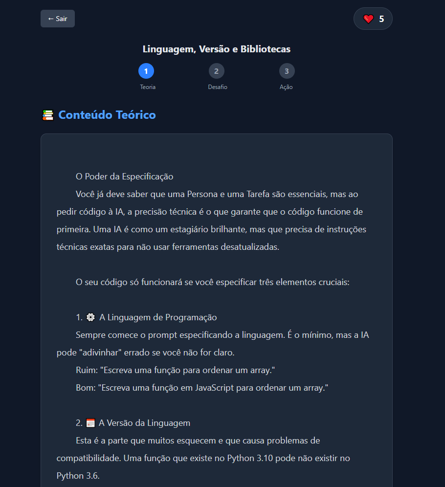
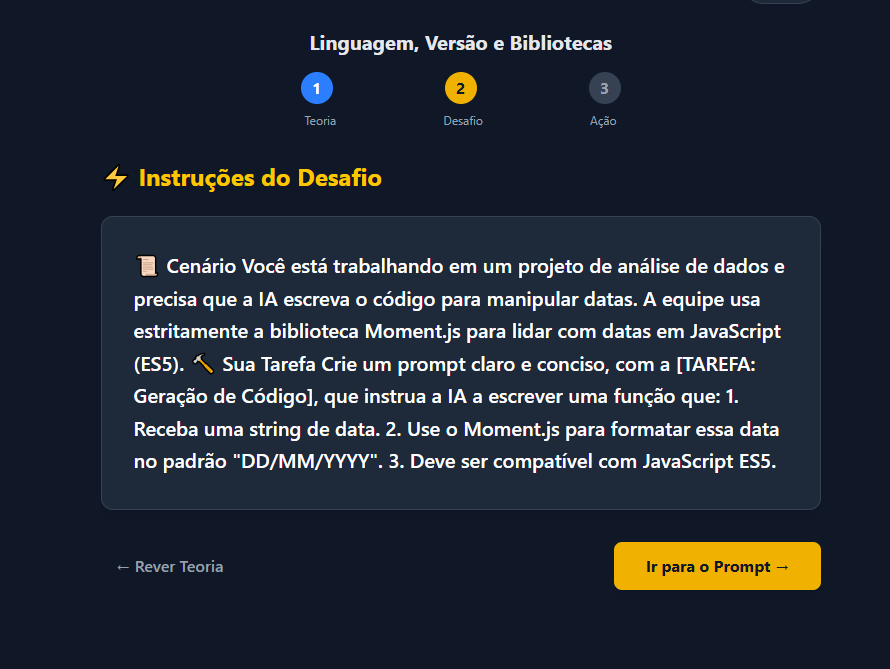
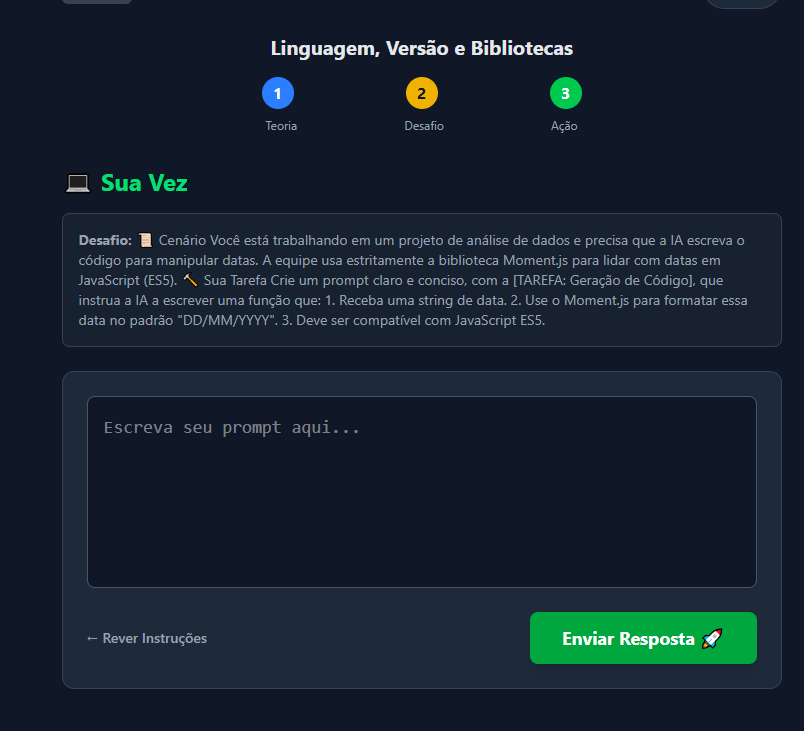
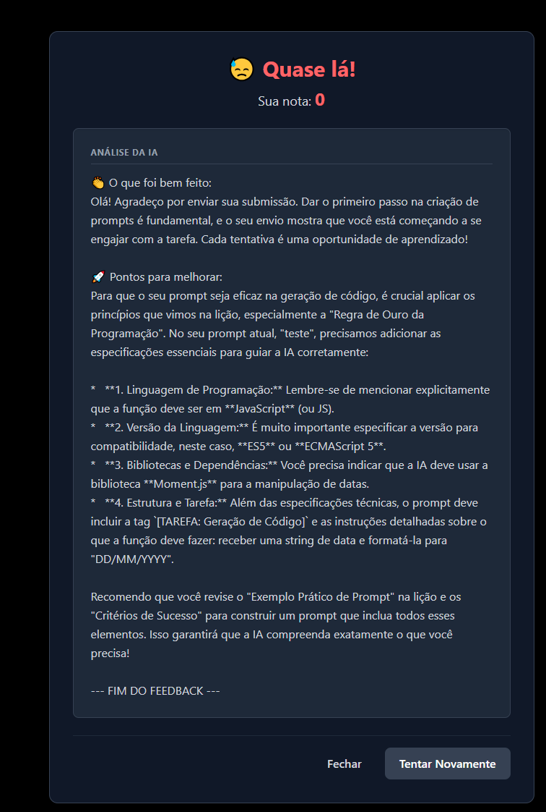

# PrompMaster - engenharia de prompt gamificada

## 📌 Descritivo do projeto

Este repositório contém o código-fonte e a documentação oficial do PromptMaster, uma plataforma gamificada criada para ensinar boas práticas de Engenharia de Prompt aos colaboradores de empresas que utilizam chat IA no dia a dia do trabalho.

Aqui você encontrará toda a estrutura do projeto, incluindo:

- Interface e componentes front-end

- Fluxo de navegação e páginas principais

- Documentações funcionais e técnicas do produto

---

## Status do Projeto

versão do projeto: 1.0 

---

## Sumario

```
├── Sobre o projeto
├── Tecnologias Utilizadas 
├── Instalação
├── Como Usar
├── Estrutura de Pastas 
├── Endpoints ou Rotas Principais
├── Autores e Créditos 
├── Screenshots / Demonstração 
├── Contato 
├── Links importantes

```

## Sobre o Projeto

Plataforma Gamificada de Treinamento em Prompt Engineering

O PromptMaster é uma plataforma criada para treinar colaboradores em boas práticas de Prompt Engineering, usando uma metodologia parecida com o Duolingo:
progressiva, gamificada, motivacional e baseada em trilhas temáticas.

O objetivo é transformar qualquer colaborador em um usuário avançado de IA, capaz de produzir prompts claros, eficientes e padronizados segundo as diretrizes internas da empresa.

## Objetivos do PromptMaster

- Ensinar boas práticas de escrita de prompts

- Padronizar comunicação com modelos de IA

- Gamificar o processo de aprendizado

- Permitir que colaboradores evoluam no próprio ritmo

- Criar uma cultura interna de excelência em IA

---

## 💻 Tecnologias Utilizadas

- React 
- Tailwind
- Typescript

---

# Instalação 

Siga as etapas abaixo para instalar e executar o PromptMaster, um projeto desenvolvido com React + TypeScript + Vite + TailwindCSS.

---

## Pré-requisitos

Antes de iniciar, certifique-se de ter instalado:

Node.js — versão 18 ou superior

npm

Git

## Instale as dependências

Usando npm: npm install ou npm i 

---

## Como usar 

1. Crie uma conta. 
2. Faça Login na conta criada.
3. acesse a Dashboard.
4. escolha uma trilha para realizar a lista de atividades. 
5. ative a trilha que deseja. 
6. acesse a lista de exercicios. 
7. Clique na atividade e leia o conteudo teórico. 
8. Clique em "avançar" para ler as intruções.
9. Clique em " Ir para o Prompt" para e keia o desafio proposto.
10. Escreva o prompt para ser avaliado e clique em "Enviar".
11. Leia o feedback e sua nota. 
12. Escolha entre Tentar novamente ou continuar para seguir para a próxima ativade da trilha. 
13. Conclua a trilha.  
14. Escolha a próxima trilha que deseja experimentar. 

---

## 📁 Estrutura de Pastas e Arquivos

```

/assets
  (imagens utilizadas no projeto)

/components
  (componentes utilizados no projeto)

/contexts
├── AutContext.ts
├── AuthProvider.tsx
├── useAuth.ys

/pages
├── Cadastro.tsx
├── Dashboard.tsx
├── Exercicio.tsx
├── Faq.tsx
├── Home.tsx
├── Integrantes.tsx
├── Login.tsx
├── sobre-nos.tsx
├── TrilhaMap.tsx

/schema

/types
├── autenticacao.ts
├── faq.ts
├── membro.ts
├── stat.ts
├── user.ts

App.tsx
Index.css

```
---
## Endpoint ou Rotas Principais 

## Rotas de Trilhas

GET /trilhas
 - Busca todas as trilhas existentes no sistema.

GET /trilhas/ativas/{usuarioId}
- Retorna uma lista contendo os IDs das trilhas ativadas pelo usuário.

POST /trilhas/{usuarioId}/ativar/{trilhaId}
- Ativa uma trilha para o usuário.
- Restrições aplicadas no back-end:
- Só pode ativar uma trilha se a anterior estiver concluída.
- Não ativa trilha já ativada.

GET /trilhas/{trilhaId}/licoes/{usuarioId}
- Retorna todas as lições da trilha, identificando o status:
- locked
- current
- completed

## Rotas de Lições

GET /licoes/{licaoId}
- Retorna o conteúdo completo da lição:
- título
- conteúdo teórico
- instrução
- ID interno da lição

Usado na tela da atividade.

## Rotas de Avaliação de Prompt

POST /prompt/feedback
- Recebe o prompt do usuário, avalia e devolve o feedback do prompt enviado.
---

## 👨‍💻 Integrantes / Autores e Créditos

- **Guilherme Santos Fonseca** – RM: 564232  
- **Gustavo Araujo da Silva** – RM: 566526  
- **Anthony de Souza Henriques** – RM: 566188  

---
# Screenshots / Demonstração 

 
 
 
 
 
 

---

## Contato

- **Guilherme Santos Fonseca** – [Linkedin](https://www.linkedin.com/in/gustavo-araujo-677aa12b1/) 
- **Gustavo Araujo da Silva** –  [Linkedin](https://www.linkedin.com/in/guilherme-fonseca-2b57b5358)
- **Anthony de Souza Henriques** – [Linkedin](https://br.linkedin.com/in/anthony-henriques-69b256368)

---

## Links importantes

## 🔗 Repositório no GitHub

- **Repositório no GitHub:** [https://github.com/PromptMaster-1TDSPX-2025/Front](https://github.com/PromptMaster-1TDSPX-2025/Front)

## Vídeo da plataforma

- **Vídeo Demonstrativo no YouTube:** [https://youtu.be/h4OAjRIPWPQ](https://youtu.be/h4OAjRIPWPQ)

## Link para o Vercel

- **Vercel:** [https://prompt-master-pearl.vercel.app/](https://prompt-master-pearl.vercel.app/)

---
